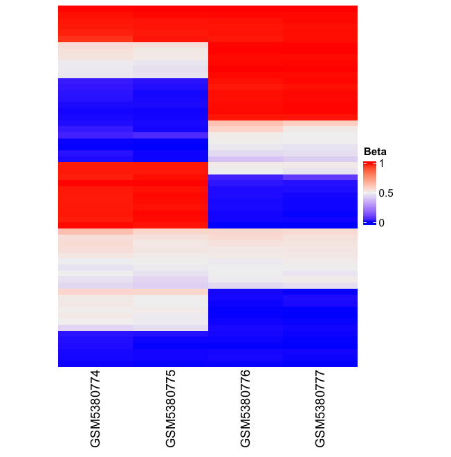
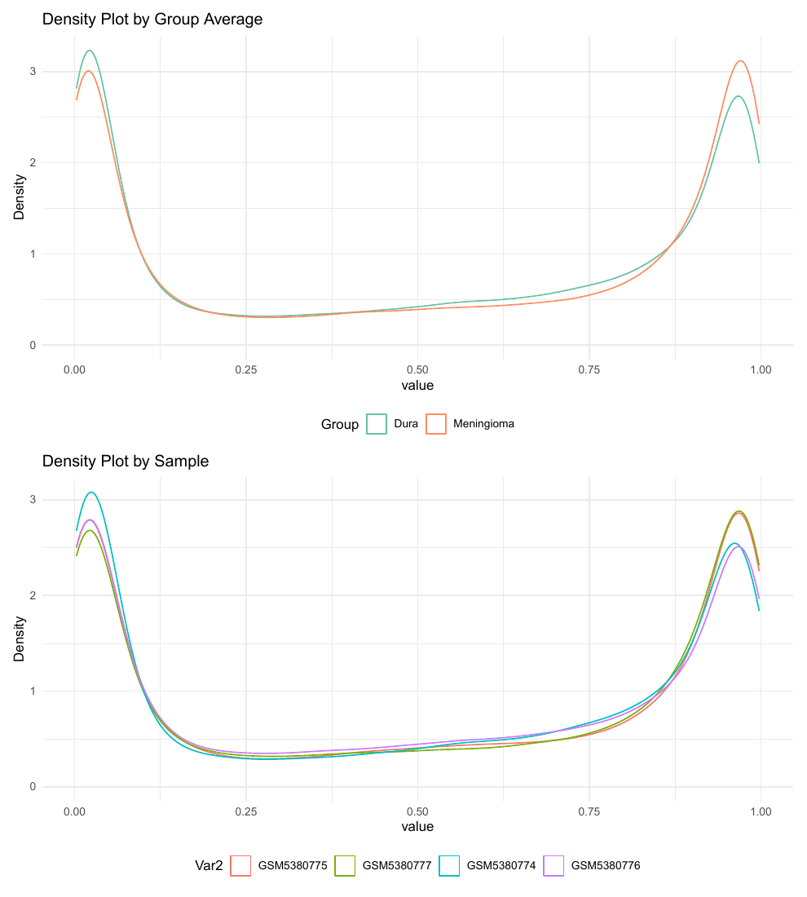
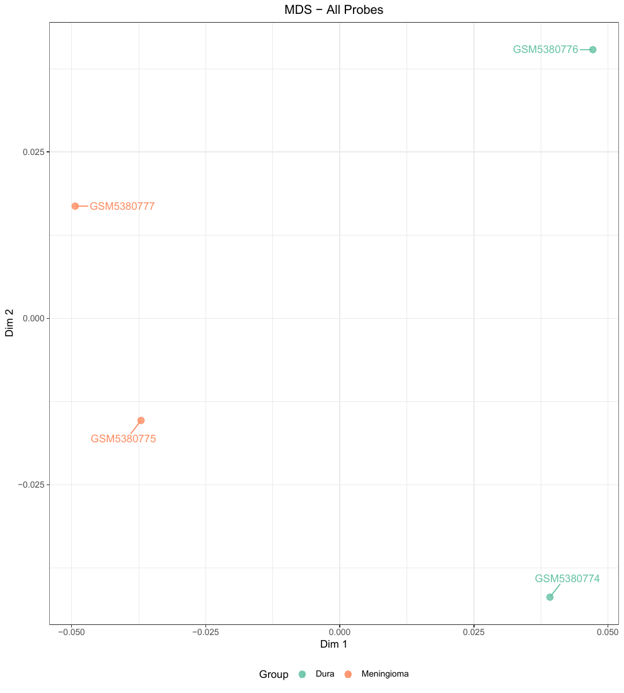
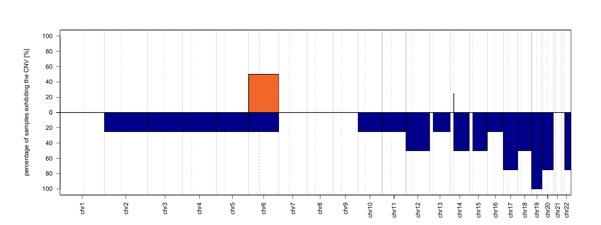
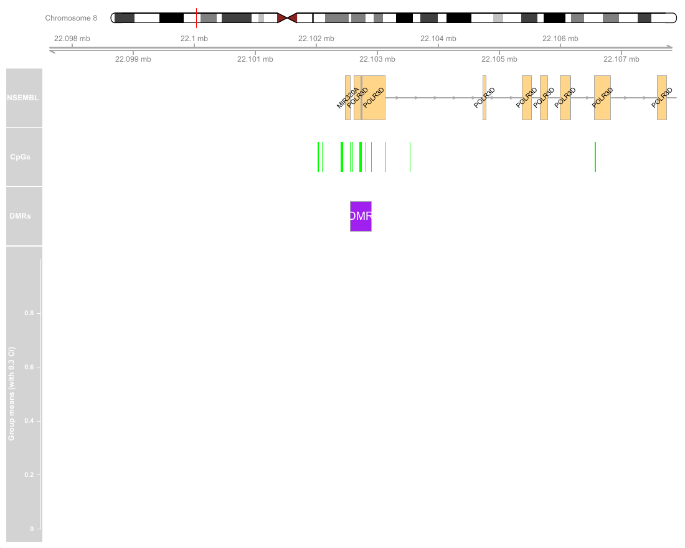
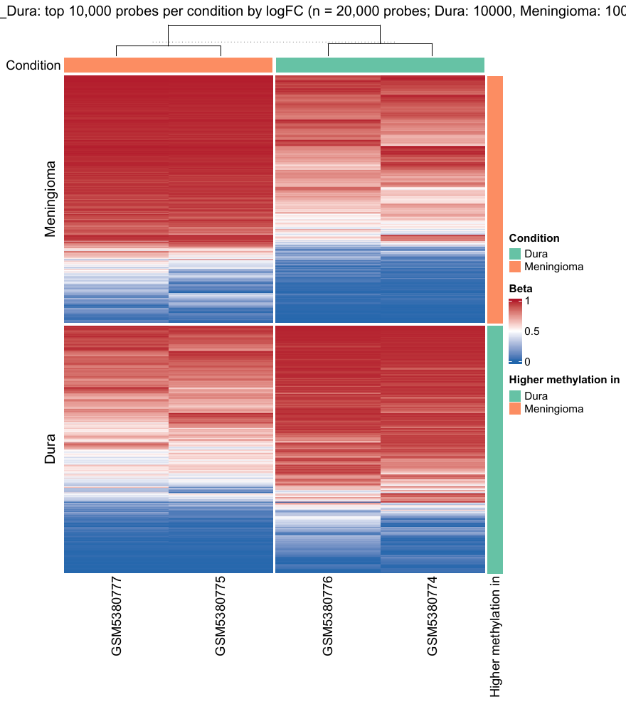
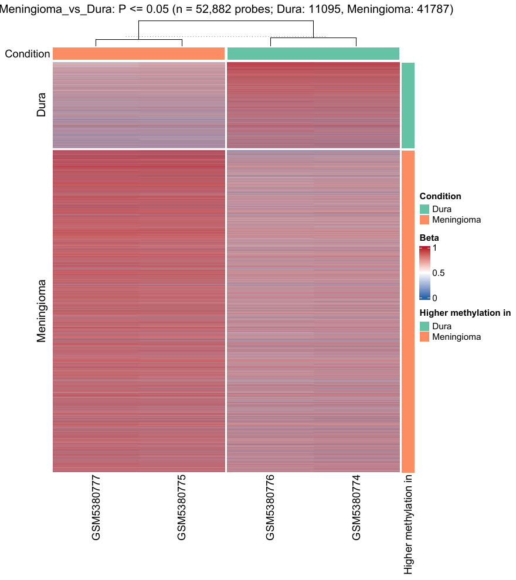
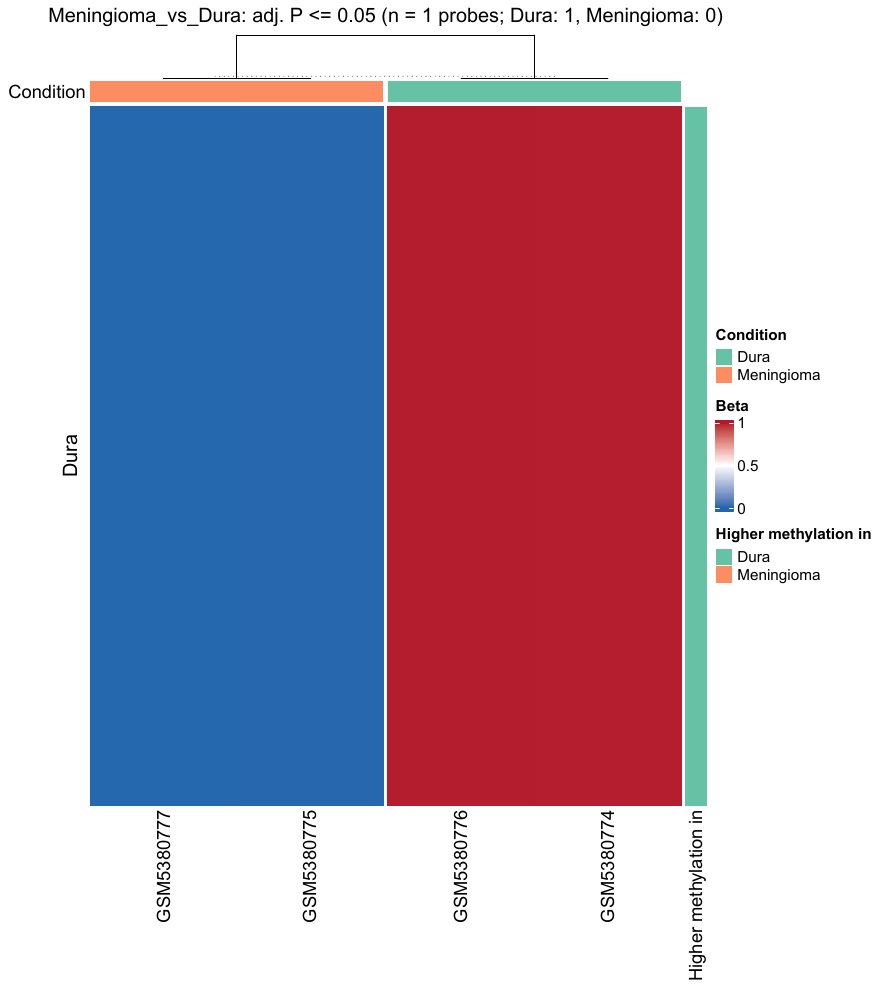

## Overview

This report summarises a run of the DNA methylation pipeline (test) on a
small set of public Illumina 450K arrays. The pipeline processes IDATs
with sesame, runs QC, calls copy-number alterations with conumee2,
classifies samples, and finds differentially methylated regions with
DMRcate.

## Sample QC

4 samples were processed. Flagged samples are marked in the table.

| Sample_ID  | frac_dt_mk | mean_intensity_MU | RGdistort | any_flag | flag_reason  |
|:-----------|-----------:|------------------:|----------:|:---------|:-------------|
| GSM5380774 |          1 |          6792.606 |     1.099 | FALSE    | sex_mismatch |
| GSM5380775 |          1 |          9496.845 |     1.083 | FALSE    | sex_mismatch |
| GSM5380776 |          1 |         10951.251 |     1.101 | FALSE    |              |
| GSM5380777 |          1 |         12818.100 |     1.097 | FALSE    |              |

### SNP-probe heatmap

Samples from the same individual should cluster together.

## Beta-value distributions and MDS

Density plots (by group and by sample) and an MDS plot of the cleaned
beta values after detection p-value, SNP, cross-hybridising and
replicate-probe filtering.

## Copy-number alterations

Number of CNA segments per sample:

| Sample     | Freq |
|:-----------|-----:|
| GSM5380774 |   22 |
| GSM5380775 |   22 |
| GSM5380776 |   23 |
| GSM5380777 |   22 |

## Methylation classifier

| Sample_ID  | DNA_methylation_group | DNA_methylation_subgroup |
|:-----------|:----------------------|:-------------------------|
| GSM5380775 | Immune-enriched       | Immune-enriched          |
| GSM5380777 | Merlin-intact         | Merlin-intact            |
| GSM5380774 | Immune-enriched       | Immune-enriched          |
| GSM5380776 | Immune-enriched       | Immune-enriched          |

## Differentially methylated regions (DMRcate)

1 DMRs were called. Top 1 by minimum smoothed FDR:

| contrast | seqnames | start | end | width | no.cpgs | min_smoothed_fdr | meandiff | overlapping.genes |
|:---|:---|---:|---:|---:|---:|---:|---:|:---|
| Meningioma_vs_Dura | chr8 | 22102556 | 22102902 | 347 | 8 | 0 | -0.124 | POLR3D, MIR320A |

## Differential methylation heatmaps

Beta values for the top probes per condition, probes with P \<= 0.05 and
probes with adjusted P \<= 0.05. Columns are annotated by condition and
rows by the condition with higher methylation.

*Generated from pipeline outputs on 2026-10-07.*
