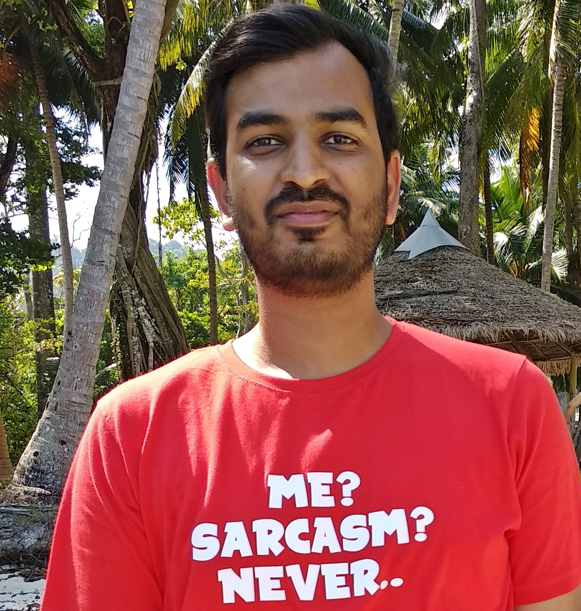

::: profile
{.headshot width=240 height=240}

**Postdoctoral Researcher**\
[UCSF](https://cancer.ucsf.edu/)
:::

Postdoctoral researcher in the field of cancer neuroscience working with [Dr David R. Raleigh](https://cancer.ucsf.edu/people/raleigh.david) at [UCSF](https://cancer.ucsf.edu/), using big data to identify drivers of meningioma intra-tumor heterogeneity. [Learn more.](postdoctoral-research.qmd)

My PhD at CSIR-IGIB, Delhi, India, focused on skin pigmentation and melanocyte biology, combining computational and experimental approaches to understand melanocyte cell state/lineage transitions. [Learn more.](phd-research.qmd)

[Skilled in computational as well as experimental biology techniques.](cv.qmd)

Want to see how your favourite gene behaves across multiple melanocyte developmental and functional states? Check out [MelDat](https://ayushagg.shinyapps.io/MelDat/), a Shiny web application I developed to quickly explore melanocyte related (bulk and single-cell) datasets. You can even visualize your own RNA-seq or microarray datasets and create publication quality figures.

## Publications

::: {#refs}
:::

## Contact

[The Raleigh Laboratory](https://raleighlab.ucsf.edu/)\
[UCSF Helen Diller Family Comprehensive Cancer Center](https://cancer.ucsf.edu/), 1450 3rd Street, Mission Bay, San Francisco 94158
