<video controls autoplay loop muted playsinline style="display:block; margin:0 auto; max-width:100%;" src="images/Presentation1.mp4"></video>

Melanocytes develop from multipotent neural crest cells which, via multiple state transitions, eventually give rise to a mature melanocyte that imparts its function of photoprotection to the skin and the hair follicle. There are broadly two kinds of transitions: developmental context and functional (homeostatic) context. My work involves understanding both these transitions in detail.

## Unravelling Melanocyte Heterogeneity using Single Cell Methodologies

The ultraviolet (UV) radiation triggers a pigmentation response in human skin, wherein, melanocytes rapidly activate divergent maturation and proliferation programs. Using single-cell sequencing, we demonstrate that these 2 programs are segregated in distinct subpopulations in melanocytes of human and zebrafish skin. The coexistence of these 2 cell states in cultured melanocytes suggests possible cell autonomy. Luria–Delbrück fluctuation test reveals that the initial establishment of these states is stochastic. Tracking of pigmenting cells ascertains that the stochastically acquired state is faithfully propagated in the progeny. A systemic approach combining single-cell multi-omics (RNA+ATAC) coupled to enhancer mapping with H3K27 acetylation successfully identified state-specific transcriptional networks. This comprehensive analysis led to the construction of a gene regulatory network (GRN) that under the influence of noise, establishes a bistable system of pigmentation and proliferation at the population level. This GRN recapitulates melanocyte behaviour in response to external cues that reinforce either of the states. Our work highlights that inherent stochasticity within melanocytes establishes dedicated states, and the mature state is sustained by selective enhancers mark through histone acetylation. While the initial cue triggers a proliferation response, the continued signal activates and maintains the pigmenting subpopulation via epigenetic imprinting. Thereby our study provides the basis of coexistence of distinct populations which ensures effective pigmentation response while preserving the self-renewal capacity. [The manuscript is published in PLOSBiology.](https://journals.plos.org/plosbiology/article?id=10.1371/journal.pbio.3002776)

```{=html}
<center>
<blockquote class="twitter-tweet"><p lang="en" dir="ltr">Delighted to share that the first Aggarwal et al publication is now online @PLOSBiology. Huge thanks to all who contributed and made it possible @PigmentCellBio @BABITAS51701178 @keerthic_aswin @mkjolly15  @rajesh_gokhale @IGIBSocial
https://t.co/4RVhhIOgaJ</p>&mdash; Ayush Aggarwal (@AggarwalAyush_) <a href="https://x.com/AggarwalAyush_/status/1826119375453302929?ref_src=twsrc%5Etfw">August 21, 2024</a></blockquote>
<script async src="https://platform.x.com/widgets.js" charset="utf-8"></script>
<center>
```

::: {.slide-grid}
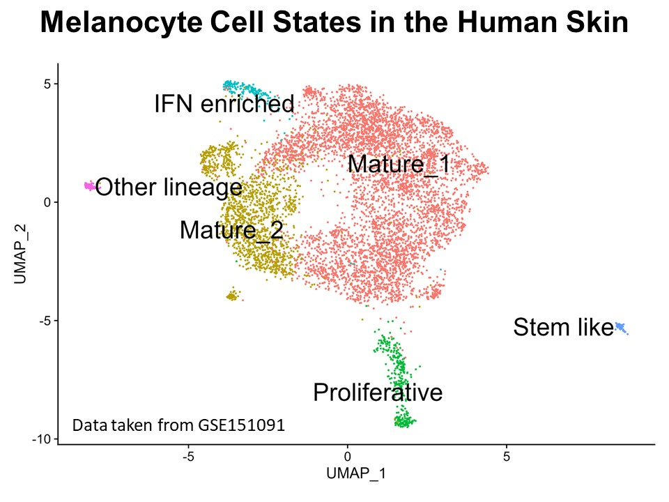

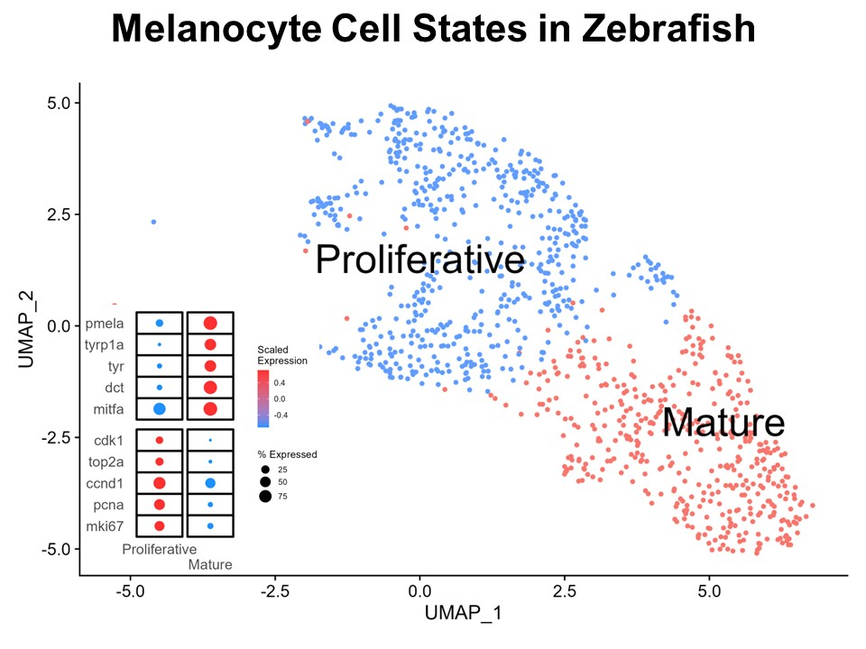

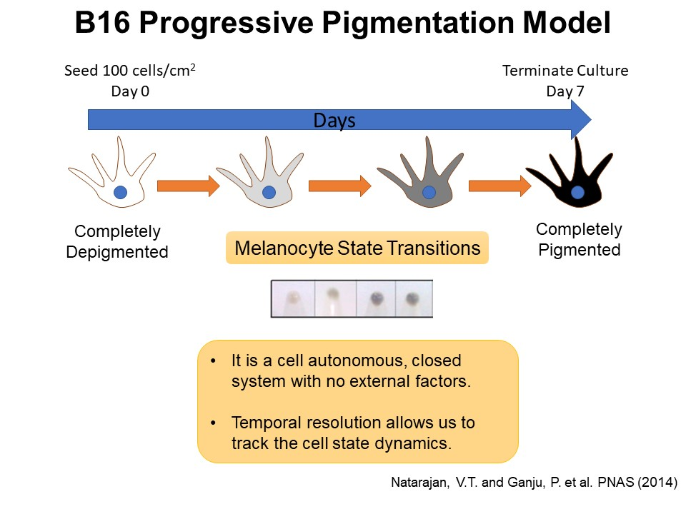

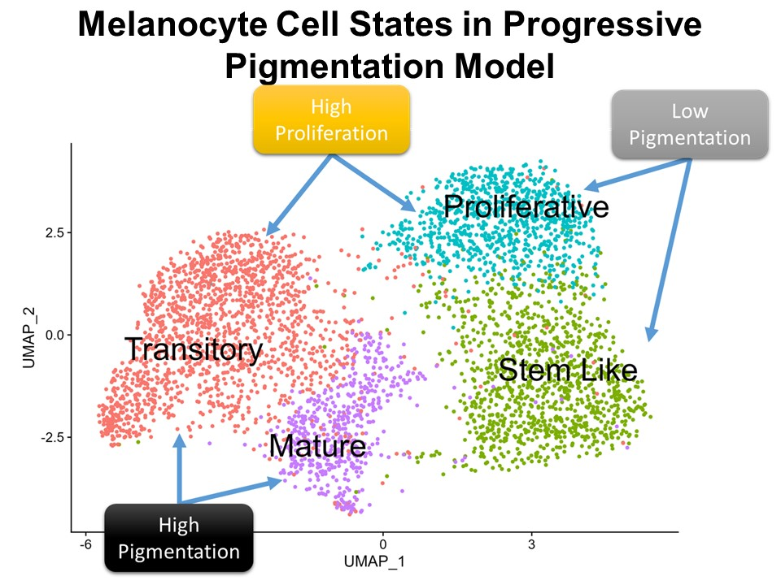

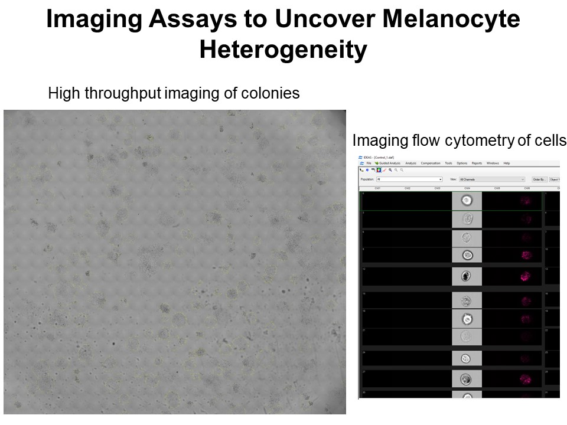

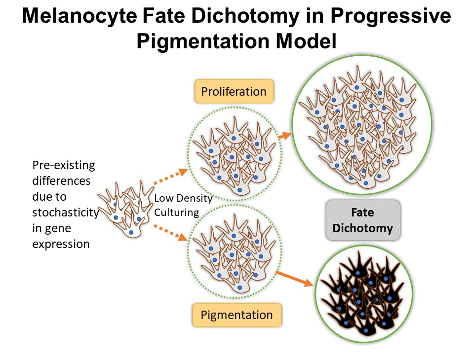

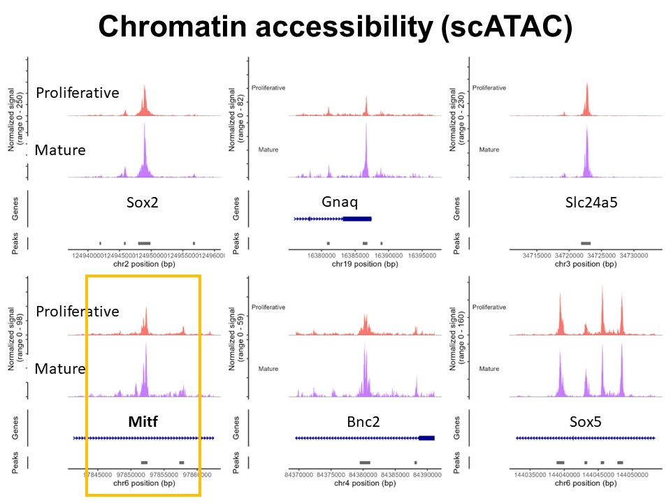

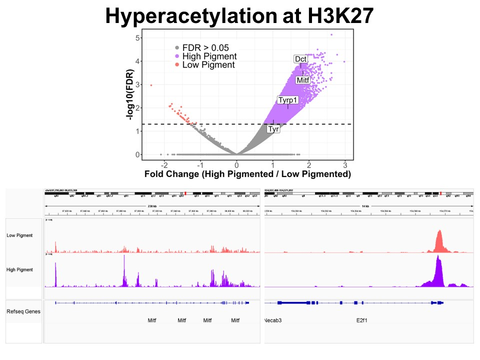

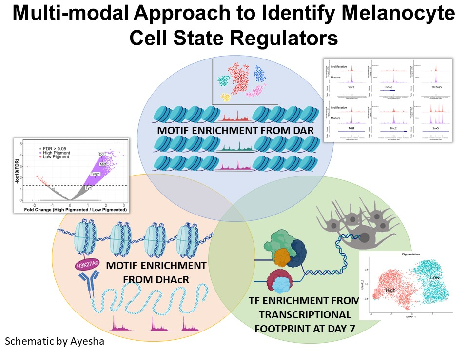

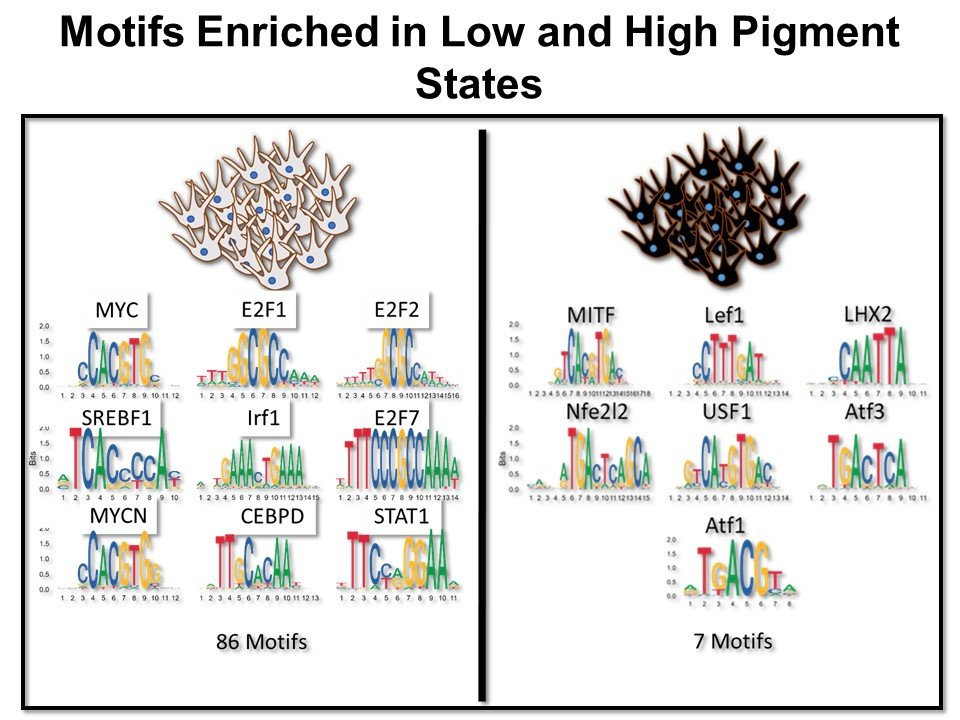

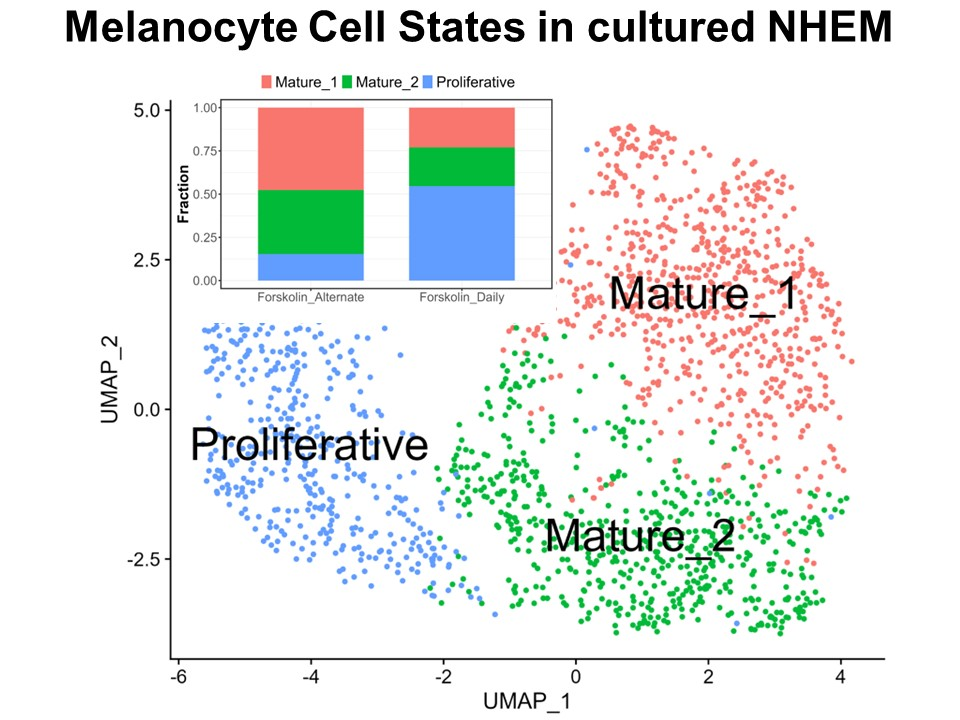

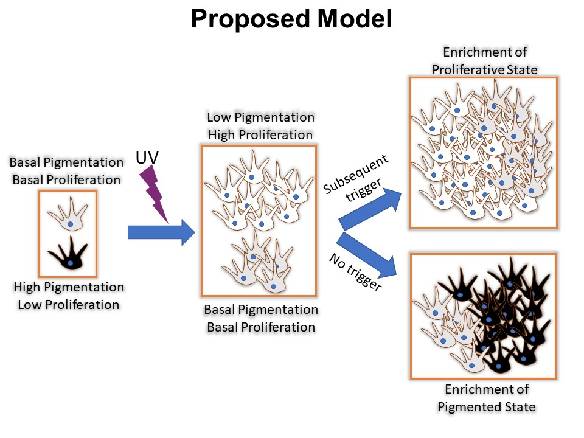
:::

## Identification of Novel Regulators of Melanocyte Development using a Data Driven Approach

Melanocytes arise from multipotent neural crest cells through a *sox10*+ progenitor capable of adopting multiple cell fates. What directs these progenitors specifically toward the melanocyte lineage remains an important question. To uncover previously unknown regulators of this fate decision, I integrated multiple publicly available datasets spanning melanocyte development to systematically identify candidate genes that may drive melanocyte specification. This approach led to the discovery of **Mgat4b as a novel regulator of melanocyte development**, a finding we subsequently validated and reported in [PNAS](https://www.pnas.org/doi/10.1073/pnas.2423831122).

::: {.slide-grid}
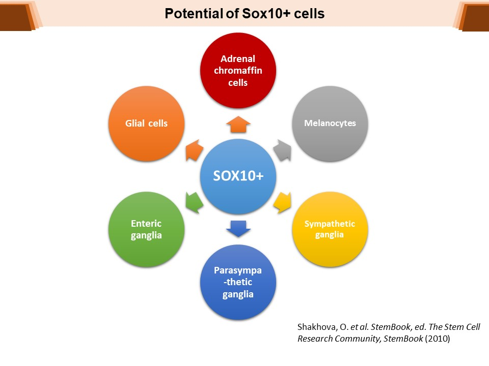

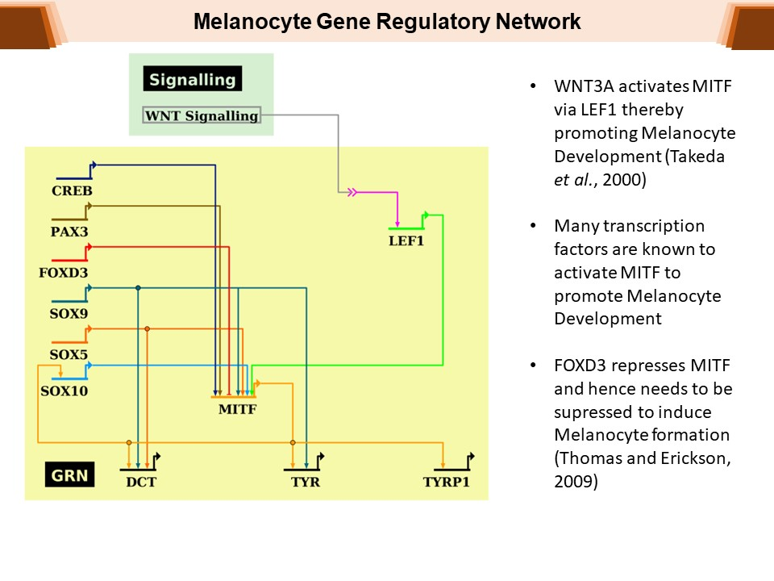
:::

## Introducing [MelDat](https://ayushagg.shinyapps.io/MelDat/): A Web-Based Application for Exploring Melanocyte Datasets

I developed an R Shiny application that provides a user-friendly platform for exploring multiple melanocyte-related datasets. Originally conceived as a resource for our laboratory, it initially contained datasets generated within our group. Eventually I expanded it to include other publicly available datasets, and plan to keep adding more. MelDat also lets you explore your own RNA sequencing or microarray datasets, generating high-quality figures suitable for publication.

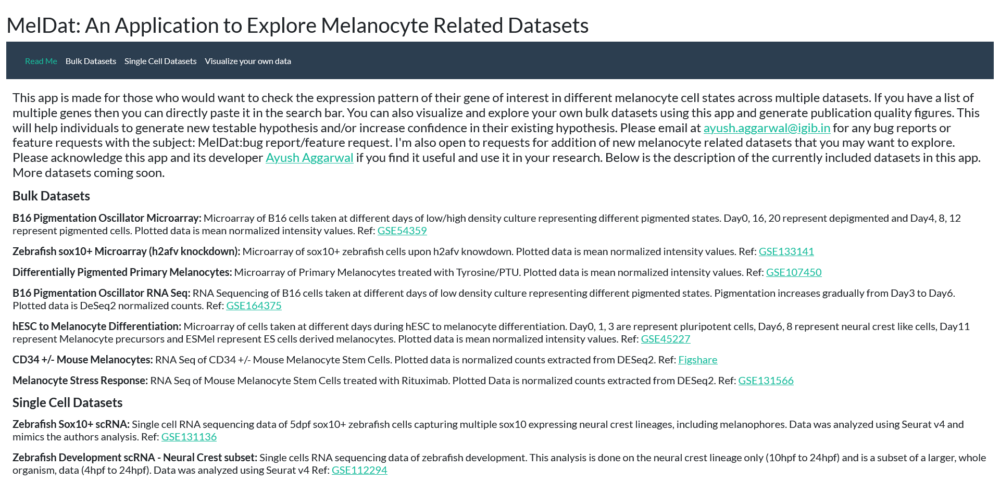
